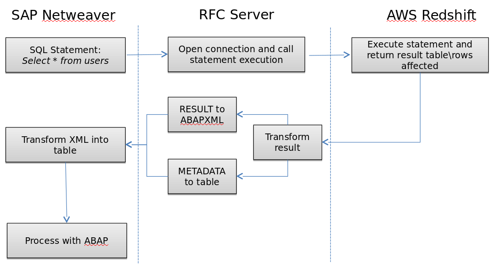

# Query AWS Redshift from SAP Netweaver
[AWS Redshift] (https://aws.amazon.com/redshift/?sc_channel=PS&sc_campaign=acquisition_US&sc_publisher=google&sc_medium=redshift_b&sc_content=redshift_bmm&sc_detail=%2Baws%20%2Bredshift&sc_category=redshift&sc_segment=108322330362&sc_matchtype=b&sc_country=US&s_kwcid=AL!4422!3!108322330362!b!!g!!%2Baws%20%2Bredshift&ef_id=WDYOcwAABDktuUPd:20161123214731:s) is a petabyte-scale data warehouse that's a fully managed and optimized for large-scale datasets.  Deep down, its built upon massive parallel processing (MPP) technology from ParAccel with a PostgreSQL flavor.  Amazon provides native ODBC and JDBC drivers so you can connect just about any business intellegence or ETL tools up to RedShift.

Like most things on AWS, you decide how much horsepower and storage you want to pay.  For about $1000 per terabyte per year, you can provide a fault-tollerant, encrypted data warehouse to unlimited users.  If you've outgrown your existing operational data stores and are considering the creation of an Enterprise Data Warehouse, be sure to give Redshift a look along with the usual suspects like Teradata, Netezza, Oracle, and the like.

In conversations with other SAP customers, they do seem to be interested in Redshift, but not exactly sure how to integrate it.  We decided to build a demonstration of one way to integrate SAP Netweaver with Redshift--specifically to allow ABAP code to execute SQL against AWS Redshift.

There are all sorts of methods one could use to integrate the two platforms--creating an ODATA or REST layer for example--but we wanted to try a method that was more "SAP-native".

## Objectives
- Allow ABAP code to submit queries--really any SQL statements--to Redshift and receive the recordset back.
- Does not require customization or non-standard access to Redshift; preserve the Redshift security, logging and monitoring models 
- Does not require customization to SAP Netweaver (other than the ABAP z-code we'll write)
- Scalable, Encrypted and Fault-tollerant

## The Scenario
For this scenario, we are going to image that our company has recently agreed to aquire another company along with about 10 years of detailed customer interactions.  We could try to load this data into our existing SAP ECC system, but the space requirements and performance impacts would be immense.  We need a way to allow the sales people to look up customer history for these new customers from within the existing tools they use for customer order management--slightly customized z-versions of SAP ECC screens.

Since we're using Personas, we have a good degree of freedom in how we present the data to the sales people, but we still have to do the heavy lifting in ABAP.  *Oh, and did I mention that we have only 2 weeks until the Board of Directors wants to announce the aquisition to the press?*  No sweat.

## The Design
We're going to use Amazon Redshift as our repository since it meets our objectives of cost, performance, fault-tollarance, scalability and encryption.  To access the customer history data, we're simply going to execute SQL queries directly against the columnar data store in Redshift and serve up the results within an SAP ECC screen.

In under 30 minutes, we can have a 2TB Redshift cluster up and running--ready for data import.   We can use the AWS Schema Conversion Tool to create the same schema in Redshift as the prior company had on its Oracle data warehouse.  We have a few different methods to import the data, but for our purposes here, we choose to dump the data onto S3 and [import it via a COPY command] (http://docs.aws.amazon.com/redshift/latest/dg/c_loading-data-best-practices.html).  *I'm not going to cover the Redshift spin-up or data migration here, as our focus is on the SAP-relevent parts.*

SAP Netweaver has ways to remotely connect to other databases via the DBCON method, but that method only supports those databases which SAP already runs on like Oracle, MSSQL, HANA, etc.  No love for PostgreSQL.  So, we have to have some intermediary that can speak to both SAP ECC and Redshift.   I can think of a few different technologies to serve the purpose but for our example, lets choose Microsoft .NET as the method (pretend we're a .NET shop).

We can create a little gateway using the SAP RFC .NET connectors as well as the Redshift ODBC connectors.  This little gateway will run as a process on some small Windows 2012 machine on premesis or on AWS EC2 and do nothing other than act as a gateway.  ABAP code will call the "virtual" function module defined in the SAP ECC system and submit a SQL string.  The SQL will then be forwarded to Redshift where it will be executed.  The results are then sent back in an array through the RFC back to the function module and to the ABAP code.

## The Steps
1.
2.
3.
4.

