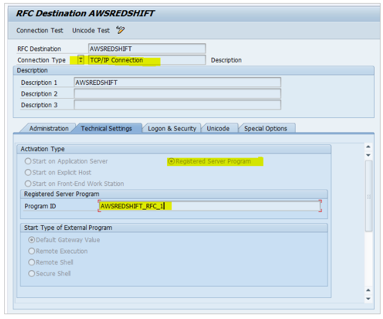
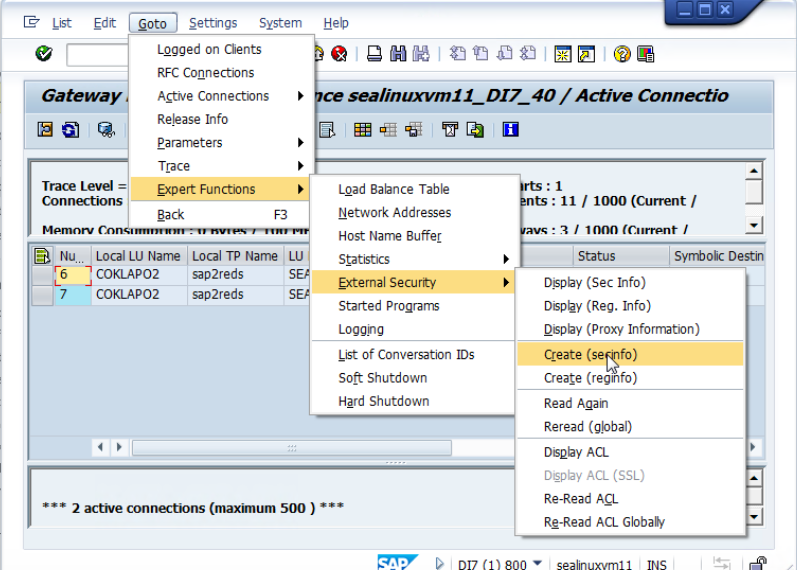
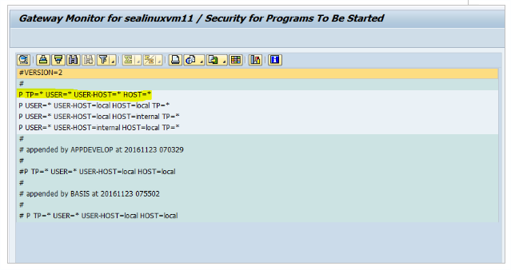
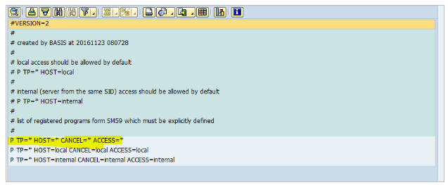
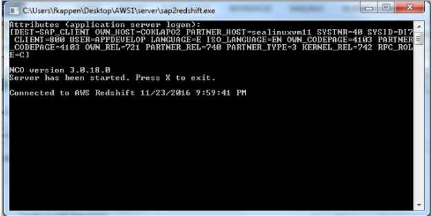
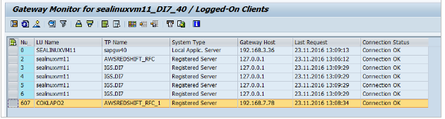
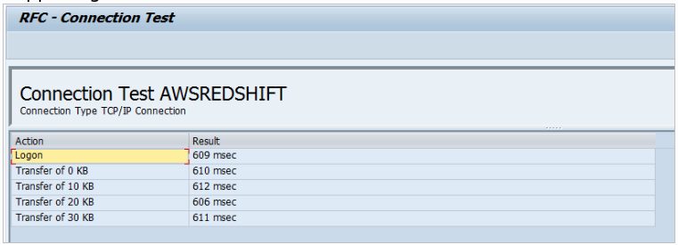
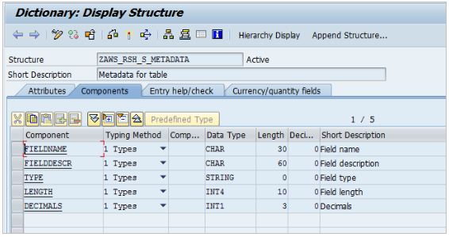
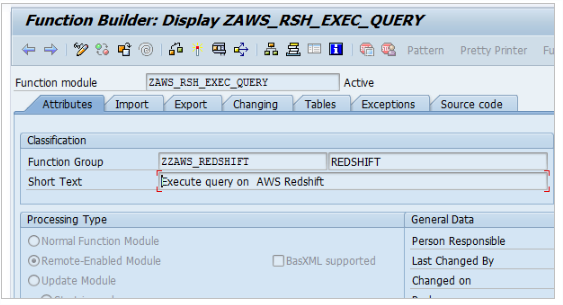

# Query AWS Redshift from SAP Netweaver
[AWS Redshift] (https://aws.amazon.com/redshift/?sc_channel=PS&sc_campaign=acquisition_US&sc_publisher=google&sc_medium=redshift_b&sc_content=redshift_bmm&sc_detail=%2Baws%20%2Bredshift&sc_category=redshift&sc_segment=108322330362&sc_matchtype=b&sc_country=US&s_kwcid=AL!4422!3!108322330362!b!!g!!%2Baws%20%2Bredshift&ef_id=WDYOcwAABDktuUPd:20161123214731:s) is a petabyte-scale data warehouse that's a fully managed and optimized for large-scale datasets.  Deep down, its built upon massive parallel processing (MPP) technology from ParAccel with a PostgreSQL flavor.  Amazon provides native ODBC and JDBC drivers so you can connect just about any business intelligence or ETL tools up to RedShift.

Like most things on AWS, you decide how much horsepower and storage you want to pay.  For about $1000 per terabyte per year, you can provide a fault-tolerant, encrypted data warehouse to unlimited users.  If you've outgrown your existing operational data stores and are considering the creation of an Enterprise Data Warehouse, be sure to give Redshift a look along with the usual suspects like Teradata, Netezza, Oracle, and the like.

In conversations with other SAP customers, they do seem to be interested in Redshift, but not exactly sure how to integrate it.  We decided to build a demonstration of one way to integrate SAP Netweaver with Redshift--specifically to allow ABAP code to execute SQL against AWS Redshift.

There are all sorts of methods one could use to integrate the two platforms--creating an ODATA or REST layer for example--but we wanted to try a method that was more "SAP-native".

## Objectives
- Allow ABAP code to submit queries--really any SQL statements--to Redshift and receive the record set back.
- Does not require customization or non-standard access to Redshift; preserve the Redshift security, logging and monitoring models 
- Does not require customization to SAP Netweaver (other than the ABAP z-code we'll write)
- Scalable, Encrypted and Fault-tolerant

## The Scenario
For this scenario, we are going to image that our company has recently agreed to acquire another company along with about 10 years of detailed customer interactions.  We could try to load this data into our existing SAP ECC system, but the space requirements and performance impacts would be immense.  We need a way to allow the sales people to look up customer history for these new customers from within the existing tools they use for customer order management--slightly customized z-versions of SAP ECC screens.

Since we're using Personas, we have a good degree of freedom in how we present the data to the sales people, but we still have to do the heavy lifting in ABAP.  *Oh, and did I mention that we have only 2 weeks until the Board of Directors wants to announce the acquisition to the press?*  No sweat.

## The Design
We're going to use Amazon Redshift as our repository since it meets our objectives of cost, performance, fault-tolerance, scalability and encryption.  To access the customer history data, we're simply going to execute SQL queries directly against the columnar data store in Redshift and serve up the results within an SAP ECC screen.

In under 30 minutes, we can have a 2TB Redshift cluster up and running--ready for data import.   We can use the AWS Schema Conversion Tool to create the same schema in Redshift as the prior company had on its Oracle data warehouse.  We have a few different methods to import the data, but for our purposes here, we choose to dump the data onto S3 and [import it via a COPY command] (http://docs.aws.amazon.com/redshift/latest/dg/c_loading-data-best-practices.html).  *I'm not going to cover the Redshift spin-up or data migration here, as our focus is on the SAP-relevant parts.*

SAP Netweaver has ways to remotely connect to other databases via the DBCON method, but that method only supports those databases which SAP already runs on like Oracle, MSSQL, HANA, etc.  No love for PostgreSQL.  So, we have to have some intermediary that can speak to both SAP ECC and Redshift.   I can think of a few different technologies to serve the purpose but for our example, lets choose Microsoft .NET as the method (pretend we're a .NET shop).

We can create a little gateway using the SAP RFC .NET connectors as well as the Redshift ODBC connectors.  This little gateway will run as a process on some small Windows 2012 machine on-premises or on AWS EC2, doing nothing other than acting as a gateway.  ABAP code will call the "virtual" function module defined in the SAP ECC system and submit a SQL string.  The SQL will then be forwarded to Redshift where it will be executed.  The results are then sent back in an array through the RFC back to the function module and to the ABAP code.


## The Steps
1. Gather the Prerequisites
2. Configure the .NET RFC Server
3. Configure SAP Netweaver RFC Destination
4. Create the SAP Function Modules
5. Run the RFC Server
6. Profit!

## 1. Gather the Prerequisites

We need to download a few prerequisites to get started:
1. Microsoft .NET 4.0 for x64
2. SAP .NET Connector 3.0 x64 (can be downloaded from SAP Marketplace)
3. ODBC Driver for AWS Redshift x64

I'm not including direct links to these files here as they tend to change around anytime Microsoft, SAP and AWS decided to refactor their websites.  You can easily find them via [El Google](https://www.google.com).

Download and install all this stuff on the machine you have tagged for running the .NET RFC Server.  During the SAP Connector 3.0 installation, be sure to choose "Install Assemblies to GAC".

## 2. Start Up the .NET RFC Server
Next, we are ready to lay down some config and start up the RFC server.  The .NET code and Visual Studio files are in the repo under `src/dotnet/sap2redshift/`.  I highly encourage you to study the code and make it your own.  *I would never just run an EXE file someone put on GitHub and neither should you.*

Once you're comfortable with the RFC Server and compiled your own version, drop it in a directory.  We also need to create a `settings.xml` file to contain the information for the RFC Server.  It looks something like this...

```xml
<?xml version="1.0" encoding="utf-8"?>
<SETTINGS>
  <SAP>
  <CLIENT>001</CLIENT>
  <LANG>EN</LANG>
  <ASHOST>localhost</ASHOST>
  <SYSNR>00</SYSNR>
  <SAPRouter></SAPRouter>
  <GWHOST>localhost</GWHOST>
  <GWSERV>SAPGW01</GWSERV>
  <NAME>SAP_CLIENT</NAME>
  <POOL_SIZE>1</POOL_SIZE>
  <MAX_POOL_SIZE>1</MAX_POOL_SIZE>
  <PROGRAM_ID>AWSREDSHIFT_RFC_1</PROGRAM_ID>
  <REPOSITORY_DESTINATION>SAP_CLIENT</REPOSITORY_DESTINATION>
  <REG_COUNT>1</REG_COUNT>
  <USER>anyuser</USER>
  <PASSWD>anypass</PASSWD>
    </SAP>
<REDSHIFT>
  <SERVER>xxx-instance.crdr0eapotgd.us-west-2.redshift.amazonaws.com</SERVER>
  <PORT>5439</PORT>
  <DB>db_test</DB>
  <USER>anyuser</USER>
  <PASSWORD>anypassword</PASSWORD>
  <KEEPALIVE>1</KEEPALIVE>
</REDSHIFT>
</SETTINGS>
```
The SAP section contains all the info from the SAP Netweaver system that you'll be using.  Take special note of the PROGRAM_ID parameter.  You'll need this in the next step.

The Redshift section contains the login information for the respective Redshift cluster.  Remember to use the cluster name rather than any individual instance name.

Now, crank that puppy up and you should see something like this.


##3. Configure SAP Netweaver RFC Destination
This configuration is done on the SAP side to create a connection between the SAP system and the RFC listener on the .NET program. In `tcode SM59`, create an RFC Destination of Type 'T'.  Notice the Program ID matches the `PROGRAM_ID` in our `settings.xml` file from Step 2. 



Next we need to create/maintain the `secinfo` and `reginfo` files.  These files are part of the security configuration to prevent the execution of external programs.  IN our case, we're going to set them wide open but in a production scenario, you'd want more granular configuration.  You can read more about these [Gateway Security Files in SAP's Help Portal](https://help.sap.com/saphelp_nw73/helpdata/en/e2/16d0427a2440fc8bfc25e786b8e11c/content.htm?frameset=/en/e2/16d0427a2440fc8bfc25e786b8e11c/frameset.htm&current_toc=/en/1d/bc8ac3c2604d678840c421c591a0a8/plain.htm&node_id=9).







If you want to test out the connection now, you can start the RFC Server program and you should be able to get a good connection test.







## 4. Create the SAP Function Modules
Next, we have to lay down some ABAP code to interact with the RFC Server.  First, we create a sort of proxy for the RFC server...its just an empty function module that's setup to point to the RFC Destination as a remote function.  We also have to create a structure to handle the metadata.





The source code for the function module is truly empty.  We're just creating a pass-through structure.

```ABAP
FUNCTION ZAWS_RSH_EXEC_QUERY.
*"----------------------------------------------------------------------
*"*"Local Interface:
*"  IMPORTING
*"     VALUE(IV_NONQUERY) TYPE  BOOLE_D DEFAULT 'X'
*"     VALUE(IV_SQL) TYPE  STRING
*"  EXPORTING
*"     VALUE(ET_METADATA) TYPE  ZAWS_RSH_T_METADATA
*"     VALUE(EV_DATA) TYPE  XSTRING
*"     VALUE(EV_STATUSCODE) TYPE  CHAR1
*"----------------------------------------------------------------------

* Look Ma, no code!

ENDFUNCTION.
```

## 5. Run the RFC Server

##6. Profit!


